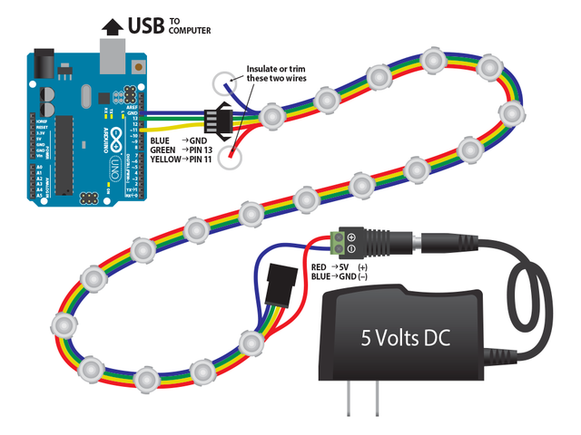
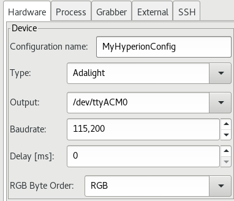
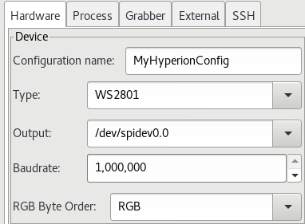

# Hyperion

Hyperion requires some hardware and software configuration. For the software configuration pls head over to [Hypercon](hypercon.md). This page will describe the process to add Hyperion to Generic x86\_64 and Raspberry Pi hardware.

## Adalight

If you want hardware that will work on any LibreELEC device, an "Adalight" setup is the best choice. It works by sending serial data to an Arduino micro controller which controls the LEDs. You need:

* Arduino \(Uno, nano, etc\)
* WS2801 LED strand
* 5V power supply
* Wire/Jumpers
* Breadboard/Protoboard \(optional\)
* Soldering iron \(optional\)



You can follow the tutorial here [https://learn.adafruit.com/adalight-diy-ambient-tv-lighting/overview](https://learn.adafruit.com/adalight-diy-ambient-tv-lighting/overview).

In [Hypercon](hypercon.md) you will need to enable:



## Raspberry Pi

Pi devices can drive an SPI output directly, and hyperion can output to an spidev device. You need:

* Raspberry Pi
* WS2801 LED strand
* 5V power supply
* Wire/Jumpers


You can find the pinout here [https://pinout.xyz](https://pinout.xyz). You will need to connect the following pins:

```text
19 MOSI -> Data
23 SCLK -> Clock
25 GND  -> Ground
```

You need to enable SPI in the config.txt file:

```text
mount -o remount,rw /flash
nano /flash/config.txt
```

Add the following line to the end of the file:

```text
dtparam=spi=on
```

Then reboot. In [Hypercon](hypercon.md) you will need to enable:



